<!-- generated-by: gsd-doc-writer -->
# Design Diagrams

Tài liệu này gom các sơ đồ Mermaid cho hệ thống `feat1`. Các sơ đồ bám theo code hiện tại trong backend Spring Boot, admin UI Vue, Kafka/outbox và các bounded context dưới `src/main/java/com/example/feat1/DDD`.

## 1. Runtime Deployment

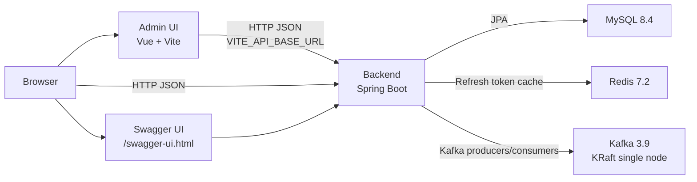

## 2. Bounded Context Map

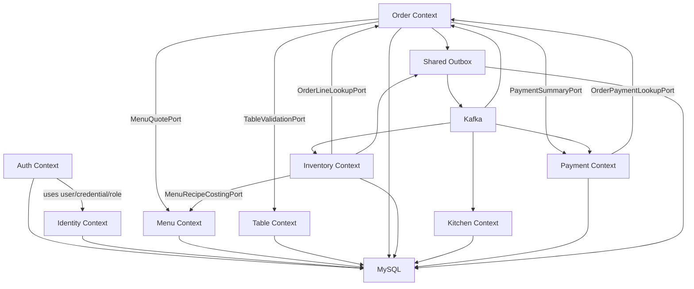

## 3. HTTP Layer To Application Services

```mermaid
flowchart TB
  AuthController["AuthController\n/auth/**"]
  UserController["UserController\n/users/**"]
  PublicMenuController["PublicMenuController\n/menus/public"]
  AdminMenuController["AdminMenuController\n/admin/menu/**"]
  TableControllers["Table Controllers\n/tables/**, /admin/tables/**"]
  CartController["CartController\n/cart/**"]
  OrderController["Order Controllers\n/orders/**, /admin/orders/**"]
  InventoryControllers["Inventory Controllers\n/admin/inventory/**"]
  KitchenController["KitchenController\n/admin/orders/kitchen-board"]
  PaymentController["PaymentController\npayments APIs"]

  AuthServices["AuthService\nTokenSerivce\nAuthSessionService"]
  UserService["UserService"]
  MenuService["MenuCatalogService\nMenuOrderValidationService"]
  TableService["TableCatalogService\nTableOperationService"]
  CartService["CartService"]
  OrderServices["OrderSubmissionService\nOrderCancellationService"]
  InventoryServices["InventoryStockService\nInventoryCostingService"]
  KitchenServices["KitchenBoardService\nKitchenTicketAdvanceService"]
  PaymentService["PaymentService"]

  AuthController --> AuthServices
  UserController --> UserService
  PublicMenuController --> MenuService
  AdminMenuController --> MenuService
  TableControllers --> TableService
  CartController --> CartService
  OrderController --> OrderServices
  InventoryControllers --> InventoryServices
  KitchenController --> KitchenServices
  PaymentController --> PaymentService
```

## 4. Authentication And Refresh Flow

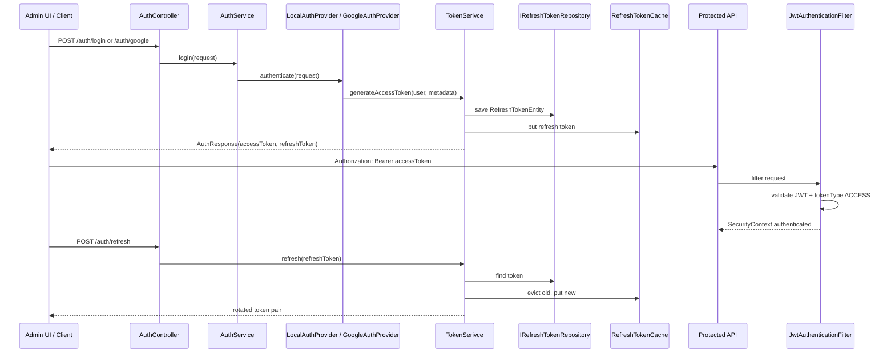

## 5. Order Confirmation Saga

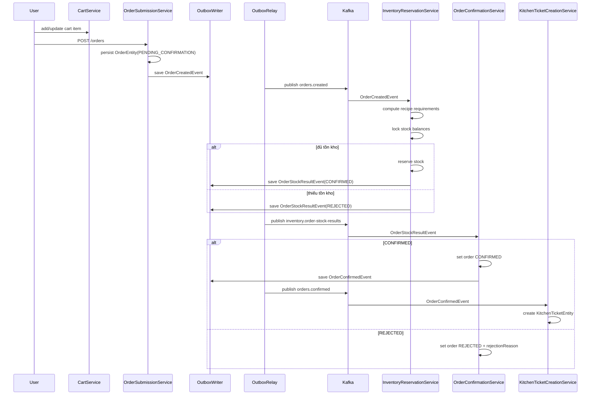

## 6. Cancellation Fan-Out

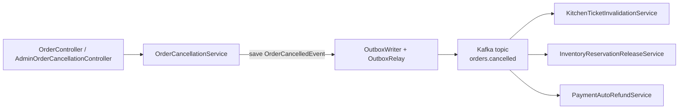

## 7. Kitchen Status And Inventory Settlement

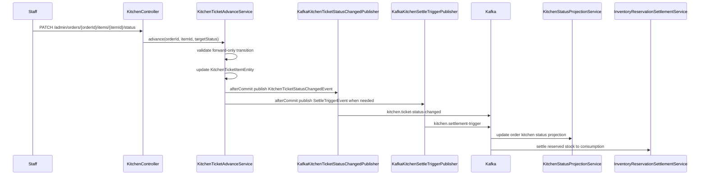

## 8. Transactional Outbox Lifecycle

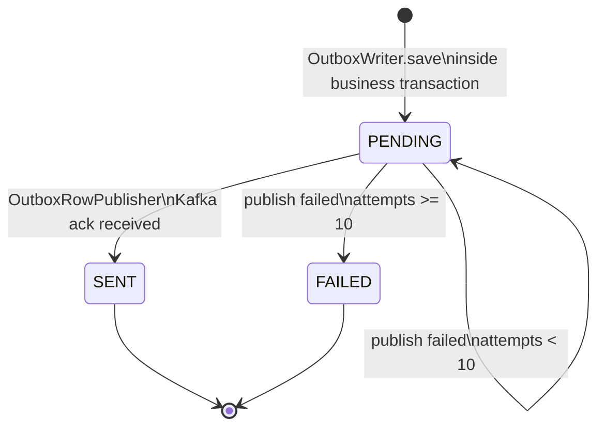

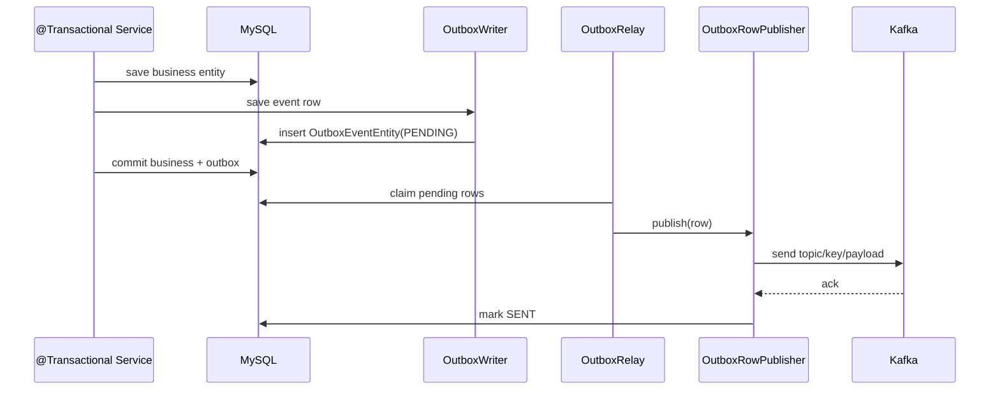

## 9. Payment Flow

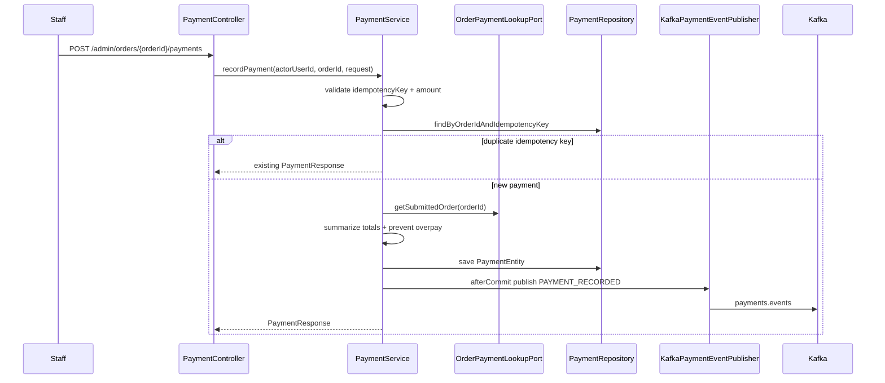

## 10. High-Level Data Relationships

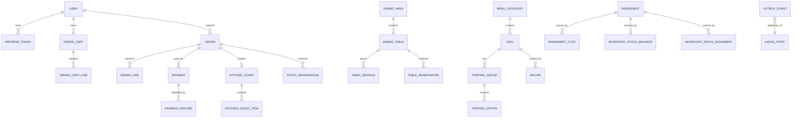

## 11. Admin UI Module Map

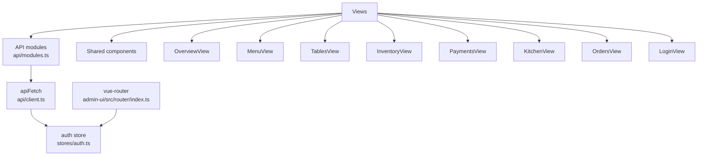

## 12. Layered Dependency Rule

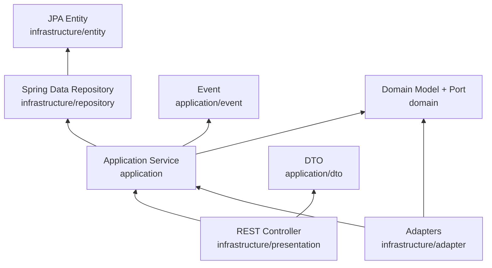
