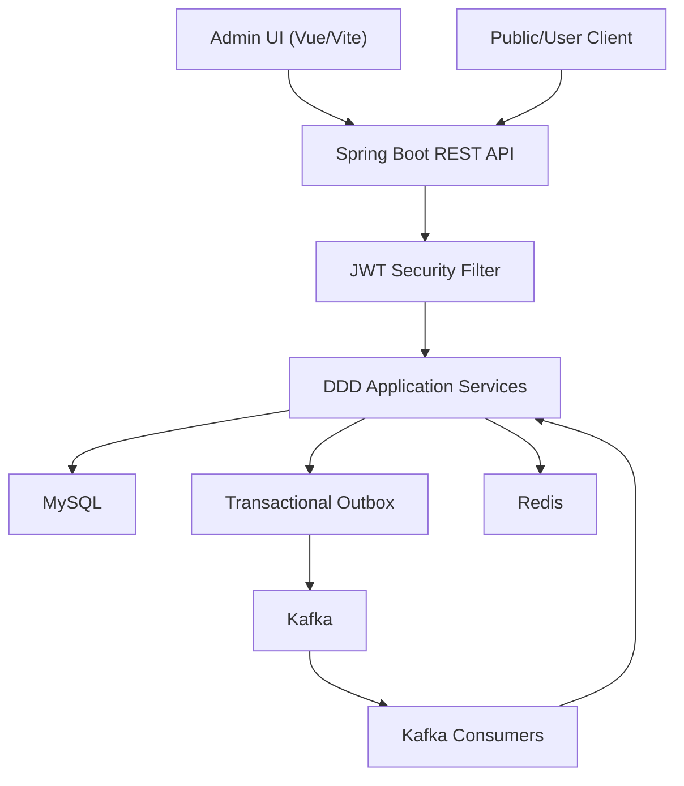
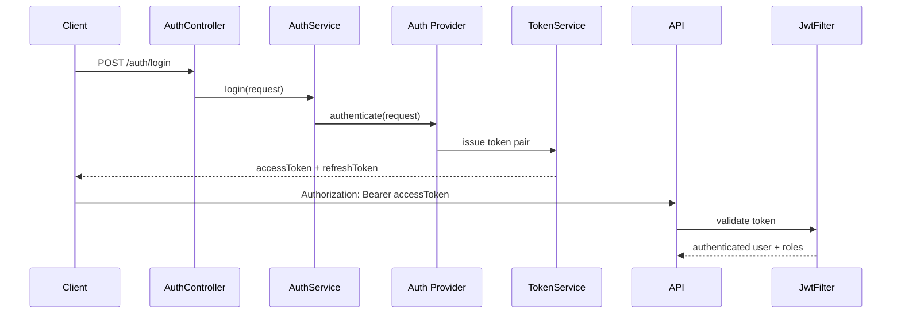
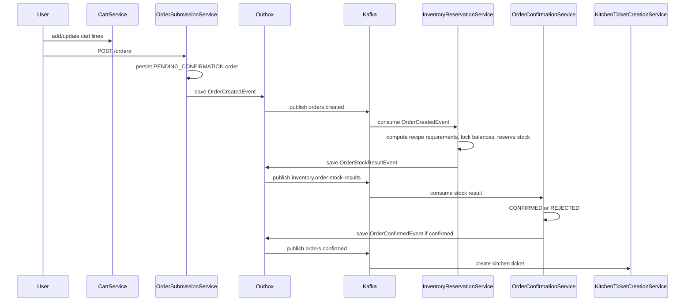

<!-- generated-by: gsd-doc-writer -->
# High Level Design

## 1. Tổng Quan

`feat1` là hệ thống quản lý vận hành nhà hàng gồm backend Spring Boot và admin UI Vue. Backend được tổ chức theo hướng Domain-Driven Design với các bounded context cho xác thực, người dùng, thực đơn, bàn, đơn hàng, bếp, tồn kho, thanh toán và outbox sự kiện. Admin UI cung cấp các màn hình vận hành cho menu, bàn, tồn kho, thanh toán, bếp và hủy đơn.

Kiến trúc tổng thể là modular monolith: các module nghiệp vụ chạy trong cùng một ứng dụng Spring Boot, giao tiếp nội bộ qua service/port, đồng thời dùng workflow event-driven qua Kafka cho các luồng cần tách rời như xác nhận đơn, giữ tồn kho, tạo ticket bếp và settlement.

Xem thêm `DESIGN_DIAGRAMS.md` để có bộ sơ đồ runtime, context map, saga, outbox, payment và frontend.

## 2. Mục Tiêu Thiết Kế

- Tách nghiệp vụ theo bounded context để mỗi miền chịu trách nhiệm một phần rõ ràng.
- Duy trì API HTTP cho thao tác đồng bộ của client và admin UI.
- Dùng Kafka/outbox cho các bước bất đồng bộ có khả năng retry và idempotency.
- Lưu trữ trạng thái nghiệp vụ chính trong MySQL thông qua Spring Data JPA.
- Bảo vệ API bằng JWT access token, refresh token và role-based authorization.
- Cho phép frontend admin hiển thị các backend gap hiện có thay vì mock dữ liệu như thể tính năng đã hoàn chỉnh.

## 3. Kiến Trúc Mức Cao

Thành phần chính:

| Thành phần | Trách nhiệm | Vị trí |
| --- | --- | --- |
| Spring Boot app | Entry point backend, auto-configuration, REST API | `src/main/java/com/example/feat1/Feat1Application.java` |
| Security | Stateless JWT authentication, route authorization, password encoder | `DDD/auth/infrastructure/security` |
| DDD contexts | Chứa controller, application service, domain model, port, repository, entity cho từng miền | `src/main/java/com/example/feat1/DDD` |
| Transactional outbox | Lưu sự kiện trong DB cùng transaction với nghiệp vụ, relay sang Kafka sau commit | `DDD/shared/outbox` |
| Admin UI | Vue SPA cho nhân viên/admin vận hành hệ thống | `admin-ui/src` |
| MySQL | Primary database cho entity JPA | `docker-compose.yml`, `application.properties` |
| Kafka | Event bus cho saga đơn hàng, tồn kho, bếp, thanh toán | `docker-compose.yml`, các `*Kafka*Config.java` |
| Redis | Hạ tầng cache/session token, hiện đã có config và adapter refresh-token cache | `config/RedisConfig.java`, `DDD/auth/infrastructure/cache` |

## 4. Bounded Contexts

### Auth Context

Auth context quản lý đăng ký, đăng nhập local/Google, refresh token, logout, email verification, password reset, audit, lockout và session revoke.

Entry points chính:

- `AuthController` expose `/auth/register`, `/auth/login`, `/auth/google`, `/auth/refresh`, `/auth/logout`, email/password recovery và `/auth/sessions`.
- `AuthService` điều phối provider đăng nhập qua `IAuthProvider`.
- `TokenSerivce`, `JwtProvider`, `JwtAuthenticationFilter` phụ trách phát hành, validate và nạp authentication vào Spring Security context.

### Identity Context

Identity context làm chủ user, credential, role và permission. Domain aggregate `User` và các repository adapter kết nối identity domain với JPA repositories.

Entry points chính:

- `UserController` expose `/users/me` và `/users/{id}`.
- `RegisterUserUseCase` được Auth context dùng khi đăng ký local.
- `UserService` và repository adapters trả về user profile/domain object.

### Menu Context

Menu context quản lý danh mục, món, topping group, topping option và recipe.

Entry points chính:

- `PublicMenuController` expose `GET /menus/public`.
- `AdminMenuController` expose CRUD admin cho category, dish, topping và recipe.
- `MenuCatalogService` đọc/ghi menu catalog.
- `MenuOrderValidationService` cung cấp quote/validation cho giỏ hàng và đơn hàng.
- `MenuRecipeCostingAdapter` nối menu recipe với inventory costing.

### Table Context

Table context quản lý khu vực ăn, bàn, trạng thái occupied, session bàn và reservation.

Entry points chính:

- `AdminTableController` expose `/admin/tables` và `/admin/tables/areas`.
- `PublicTableController` expose `GET /tables/public`.
- `TableOperationController` expose open/close/cancel table session, occupancy, availability, reservation và seat reservation.
- `TableCatalogService` quản lý area/table catalog.
- `TableOperationService` điều phối session, occupancy và reservation workflow.

### Order Context

Order context quản lý cart, submit order, stock confirmation result, kitchen status projection và cancellation.

Entry points chính:

- `CartController` expose `/cart`.
- `OrderController` expose `/orders`.
- `AdminOrderCancellationController` expose `/admin/orders/{orderId}/cancel` và cancel item.
- `OrderSubmissionService` tạo order từ cart và ghi `OrderCreatedEvent` vào outbox.
- `OrderConfirmationService` xử lý `OrderStockResultEvent` để chuyển order sang `CONFIRMED` hoặc `REJECTED`.
- `OrderCancellationService` ghi `OrderCancelledEvent` vào outbox khi hủy order/line.
- `KitchenStatusProjectionService` cập nhật view trạng thái bếp cho order line.

### Inventory Context

Inventory context quản lý ingredient, cost, stock movement, stock balance, reservation, settlement và release.

Entry points chính:

- `InventoryController` expose `/admin/inventory/ingredients`, cost và costing endpoint.
- `InventoryStockController` expose stock balance, movement và low-stock endpoints.
- `InventoryReservationService` consume `OrderCreatedEvent`, tính nhu cầu recipe, giữ hàng và publish `OrderStockResultEvent`.
- `InventoryReservationSettlementService` consume settle trigger từ bếp để chuyển reserved thành consumption.
- `InventoryReservationReleaseService` release stock khi order bị hủy.
- `InventoryCostingService` tính cost của recipe và menu.

### Kitchen Context

Kitchen context quản lý ticket bếp và trạng thái item.

Entry points chính:

- `KitchenController` expose kitchen board và advance item status.
- `KitchenTicketCreationService` consume `OrderConfirmedEvent` để tạo ticket.
- `KitchenTicketAdvanceService` chuyển status item và publish `KitchenTicketStatusChangedEvent`.
- `KitchenTicketInvalidationService` consume `OrderCancelledEvent` để hủy ticket/item liên quan.
- `KafkaKitchenSettleTriggerPublisher` publish settle trigger khi line đủ điều kiện settlement.

### Payment Context

Payment context quản lý payment request QR, ghi nhận thanh toán, refund, lịch sử thanh toán và payment summary.

Entry points chính:

- `PaymentController` expose user payment endpoints theo order và admin endpoints cho payment/refund/history.
- `PaymentService` implement `PaymentSummaryPort` để Order context có thể hiển thị trạng thái thanh toán.
- `PaymentAutoRefundService` consume `OrderCancelledEvent` để tự động refund nếu cần.
- `KafkaPaymentEventPublisher` publish `PaymentEvent` khi ghi nhận thanh toán/refund.

### Shared Outbox

Outbox context là hạ tầng dùng chung để giảm dual-write gap giữa DB và Kafka.

- `OutboxWriter` ghi row `PENDING` cùng transaction với nghiệp vụ.
- `OutboxRelay` poll row pending theo lịch.
- `OutboxRowPublisher` publish từng row sang Kafka, mark `SENT`, retry và mark `FAILED` sau ngưỡng attempt.
- `OutboxEventRepository.claimPending` dùng native lock `FOR UPDATE SKIP LOCKED`, nên relay bị disable trong test profile H2.

## 5. Luồng Nghiệp Vụ Chính

### 5.1 Đăng Nhập Và Gọi API Được Bảo Vệ

Security model:

- Public auth endpoints được khai báo trong `SecurityConfig`.
- `/cart`, `/orders`, `/users/**`, `/auth/sessions/**` cần role `USER`, `ADMIN` hoặc `STAFF`.
- `/admin/**` mặc định cần role `ADMIN`, với một số operation vận hành cho phép `ADMIN` hoặc `STAFF`.
- Swagger/OpenAPI endpoints được permit.

### 5.2 Cart Đến Order-Confirmation Saga

Tính chất thiết kế:

- Đơn hàng mới bắt đầu ở `PENDING_CONFIRMATION`.
- Inventory là nơi đưa ra verdict stock `CONFIRMED` hoặc `REJECTED`.
- Mỗi consumer có processed-event ledger riêng để xử lý replay an toàn.
- Reservation stock dùng row lock theo thứ tự ingredient id tăng dần để giảm deadlock.
- Outbox đảm bảo event được ghi cùng transaction với thay đổi nghiệp vụ.

### 5.3 Kitchen Status Và Settlement

Kitchen ticket được tạo sau khi order confirmed. Khi nhân viên bếp advance item status, `KitchenTicketAdvanceService` cập nhật ticket item và publish `KitchenTicketStatusChangedEvent`. Order context consume event này để cập nhật projection trạng thái item. Kitchen cũng publish settle trigger cho inventory khi item/line đạt điều kiện settlement, và inventory chuyển reserved stock thành consumption.

### 5.4 Cancellation Và Release/Refund

Order cancellation flow tạo `OrderCancelledEvent` qua outbox. Event này được consume bởi:

- Kitchen context để invalidate ticket hoặc item liên quan.
- Inventory context để release reservation chưa settle.
- Payment context để xử lý auto-refund qua `PaymentAutoRefundService`.

### 5.5 Payment

Payment context hỗ trợ:

- User tạo QR payment request cho order của mình.
- Admin/staff ghi nhận payment bằng idempotency key.
- Admin/staff ghi nhận refund bằng idempotency key.
- Order response lấy payment summary qua `PaymentSummaryPort`.
- Payment events được publish sau commit transaction bằng `TransactionSynchronization`.

## 6. API Surface Mức Cao

| Nhóm | Endpoint đại diện | Mục đích |
| --- | --- | --- |
| Auth | `/auth/register`, `/auth/login`, `/auth/refresh`, `/auth/logout`, `/auth/sessions` | Đăng ký, đăng nhập, refresh, logout, quản lý session |
| Users | `/users/me`, `/users/{id}` | Hồ sơ người dùng |
| Public menu | `/menus/public` | Đọc menu active cho client |
| Admin menu | `/admin/menu/**` | Quản lý category, dish, topping, recipe |
| Public tables | `/tables/public`, `/tables/public/availability` | Đọc bàn và availability |
| Admin tables | `/admin/tables/**`, `/admin/table-sessions/**` | Quản lý khu vực, bàn, session, reservation |
| Cart | `/cart/**` | Giỏ hàng của user |
| Orders | `/orders/**` | Submit, xem và hủy đơn của user |
| Admin orders | `/admin/orders/**` | Hủy đơn/line bởi staff/admin |
| Kitchen | `/admin/orders/kitchen-board`, `/admin/orders/{orderId}/items/{itemId}/status` | Bảng bếp và advance item |
| Inventory | `/admin/inventory/**`, `/admin/menu/recipes/cost`, `/admin/menu/costing` | Ingredient, cost, stock, movement, costing |
| Payments | `/orders/{orderId}/payments`, `/orders/{orderId}/payment-requests/qr`, `/admin/payments`, `/admin/orders/{orderId}/payments`, `/admin/payments/{paymentId}/refunds` | QR payment, record payment, refund, history |

## 7. Data Model Mức Cao

| Context | Entity/aggregate tiêu biểu | Ghi chú |
| --- | --- | --- |
| Auth | `RefreshTokenEntity`, `SecurityAuditEventEntity`, `AuthActionTokenEntity` | Token session, audit, action token email/password |
| Identity | `UserEntity`, `CredentialEntity`, `RoleEntity`, `PermissionEntity` | User, credential, RBAC |
| Menu | `MenuCategoryEntity`, `DishEntity`, `ToppingGroupEntity`, `ToppingOptionEntity`, `RecipeEntity` | Catalog và recipe |
| Table | `DiningAreaEntity`, `DiningTableEntity`, `TableSessionEntity`, `TableReservationEntity`, `TableOccupancyEntity` | Layout và trạng thái bàn |
| Order | `OrderCartEntity`, `OrderEntity`, `OrderLineEntity`, `OrderProcessedEventEntity` | Cart, order, line, idempotency ledger |
| Inventory | `IngredientEntity`, `IngredientCostEntity`, `InventoryStockBalanceEntity`, `StockReservationEntity`, `InventoryProcessedEventEntity` | Tồn kho, reservation, ledger |
| Kitchen | `KitchenTicketEntity`, `KitchenTicketItemEntity`, `KitchenProcessedEventEntity` | Ticket bếp và ledger |
| Payment | `PaymentEntity`, `PaymentRequestEntity`, `PaymentRefundEntity`, `PaymentProcessedEventEntity` | Payment, QR request, refund, ledger |
| Shared | `OutboxEventEntity` | Persistent event bus buffer |

## 8. Event Và Topic Mức Cao

| Event | Producer | Consumer chính | Topic mặc định |
| --- | --- | --- | --- |
| `OrderCreatedEvent` | OrderSubmissionService | InventoryReservationService | `orders.created` |
| `OrderStockResultEvent` | InventoryReservationService | OrderConfirmationService | `inventory.order-stock-results` |
| `OrderConfirmedEvent` | OrderConfirmationService | KitchenTicketCreationService | `orders.confirmed` |
| `OrderCancelledEvent` | OrderCancellationService | Kitchen, Inventory, Payment | `orders.cancelled` |
| `KitchenTicketStatusChangedEvent` | KitchenTicketAdvanceService | KitchenStatusProjectionService | `kitchen.ticket-status-changed` |
| `SettleTriggerEvent` | Kitchen settle publisher | InventoryReservationSettlementService | `kitchen.settlement-trigger` |
| `PaymentEvent` | PaymentService | External/internal consumers | `payments.events` |
| `TableOperationEvent` | TableOperationService | External/internal consumers | `tables.events` |

Kafka topic names có thể override qua `application.properties` bằng các key như `order.events.order-created-topic`, `inventory.events.order-stock-results-topic`, `payment.events.topic`, `table.events.topic`.

## 9. Frontend Admin UI

Admin UI là Vue SPA dùng Vite:

- Router: `admin-ui/src/router/index.ts`.
- API client: `admin-ui/src/api/client.ts`.
- Backend base URL: `VITE_API_BASE_URL`, mặc định `http://localhost:8080`.
- Auth store lưu access/refresh token và API client tự refresh token khi gặp 401.
- Views chính: overview, menu, tables, inventory, payments, kitchen, orders.
- `admin-ui/src/api/modules.ts` có danh sách `knownGaps` để hiển thị các backend gap thay vì giả lập tính năng đã hoàn thành.

## 10. Cấu Hình Và Runtime

Backend:

- Java 17, Spring Boot 4.0.6, Maven Wrapper.
- MySQL datasource cấu hình trong `src/main/resources/application.properties`.
- H2 được dùng cho test profile trong `src/test/resources/application.properties`.
- Redis, Kafka và MySQL local có trong `docker-compose.yml`.
- OpenAPI UI ở `/swagger-ui.html`, API docs ở `/v3/api-docs`.
- JWT config gồm `jwt.access-expiration`, `jwt.refresh-expiration`, `jwt.secret`.
- `DB_PASSWORD` không có default baked-in trong properties và cần được set qua env.

Admin UI:

- Vue 3, vue-router, Vite, TypeScript, Vitest.
- Scripts chính: `npm run dev`, `npm run build`, `npm run test`.

## 11. Chất Lượng Và Khả Năng Chịu Lỗi

- Integration và unit tests bao phủ nhiều context: auth, menu, table, order, kitchen, inventory, payment và outbox.
- Kafka consumers dùng DLT configuration ở từng context để xử lý record lỗi.
- Saga consumers dùng processed-event ledger để idempotent khi Kafka redeliver.
- Outbox relay retry event publish và mark `FAILED` sau 10 attempts.
- Test profile tắt Kafka auto-startup, outbox relay và outbox retention để tránh phụ thuộc broker/H2 lock không tương thích.

## 12. Giới Hạn Và Rủi Ro Hiện Tại

- Hệ thống là modular monolith: bounded context rõ ràng trong code, nhưng vẫn deploy chung một Spring Boot application.
- Outbox relay comment chỉ rõ topology hiện tại là single-instance; nếu scale nhiều instance cần đánh giá lại duplicate publish và locking behavior.
- Một số admin-ui gap đã được khai báo rõ trong `knownGaps`, ví dụ admin menu listing, reservation listing, global order search và filter nâng cao cho payments.
- `PaymentService` publish payment events sau commit trực tiếp qua publisher, không qua shared outbox như order/inventory flow.
- Tên package/class vẫn có legacy spelling như `infastructure` và `TokenSerivce`; tài liệu giữ nguyên tên hiện có để khớp code.

## 13. Hướng Mở Rộng Đề Xuất

- Chuẩn hóa API contract bằng OpenAPI docs generated từ controller và DTO.
- Cân nhắc đưa `PaymentEvent` vào shared outbox nếu payment event cần cùng durability pattern với order saga.
- Tách các context thành module Maven riêng nếu team cần enforced compile-time boundary.
- Bổ sung admin endpoints còn thiếu cho menu listing, reservation listing, global order search và payment filters.
- Lập kế hoạch multi-instance outbox relay nếu backend cần horizontal scaling.
- Chuẩn hóa naming `infastructure` thành `infrastructure` và `TokenSerivce` thành `TokenService` khi có thời điểm refactor an toàn.
