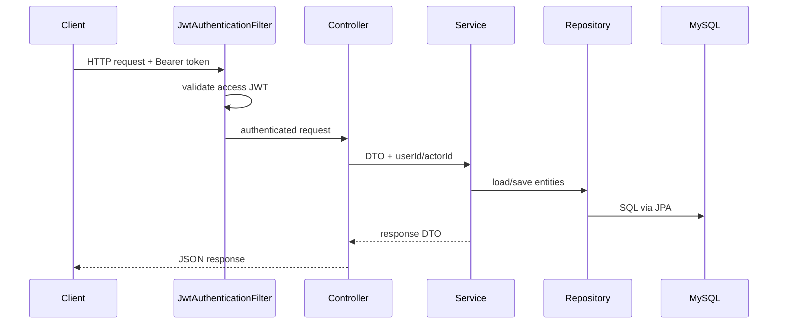

<!-- generated-by: gsd-doc-writer -->
# Low Level Design

## 1. Phạm Vi

Tài liệu này mô tả thiết kế mức thấp của `feat1` dựa trên code hiện tại. Trọng tâm là cấu trúc package, controller/service/repository, DTO, transaction boundary, Kafka listener/publisher, outbox, lỗi và các thuật toán nghiệp vụ chính.

Tài liệu này bổ sung cho `HIGH_LEVEL_DESIGN.md`: HLD mô tả hệ thống ở mức bức tranh tổng thể, còn LLD mô tả cách các lớp hiện tại phối hợp để thực thi từng luồng.

## 2. Cấu Trúc Package

Backend chính nằm dưới:

```text
src/main/java/com/example/feat1/
  Feat1Application.java
  common/
    exception/
  config/
  DDD/
    auth/
    identity_context/
    menu_context/
    table_context/
    order_context/
    inventory_context/
    kitchen_context/
    payment_context/
    shared/outbox/
```

Quy ước trong mỗi context:

| Layer | Vai trò | Ví dụ |
| --- | --- | --- |
| `infrastructure/presentation` | REST controller và exception handler theo context | `AuthController`, `OrderController`, `PaymentController` |
| `application` | Use case/service nghiệp vụ, transaction boundary | `OrderSubmissionService`, `InventoryReservationService` |
| `application/dto` | Request/response DTO đi qua HTTP boundary | `CartDtos`, `PaymentDtos`, `TableOperationDtos` |
| `application/event` | Event payload dùng cho Kafka/outbox | `OrderCreatedEvent`, `PaymentEvent` |
| `domain/model` | Enum, exception, model nghiệp vụ | `OrderStatus`, `KitchenItemStatus` |
| `domain/port` | Interface để context khác hoặc adapter hạ tầng gọi vào/ra | `PaymentSummaryPort`, `MenuQuotePort` |
| `infrastructure/entity` | JPA entity | `OrderEntity`, `InventoryStockBalanceEntity` |
| `infrastructure/repository` | Spring Data JPA repositories | `OrderRepository`, `PaymentRepository` |
| `infrastructure/adapter` | Kafka listener/publisher hoặc adapter sang context khác | `OrderCreatedListener`, `KafkaPaymentEventPublisher` |
| `infrastructure/config` | Kafka producer/consumer/topic config | `InventoryKafkaConsumerConfig` |

Lưu ý: `identity_context` vẫn dùng spelling legacy `infastructure` trong đường dẫn code hiện tại. Tài liệu giữ nguyên tên này khi trỏ tới file/class để khớp repository.

## 3. Request Pipeline

Luồng HTTP đồng bộ điển hình:



Chi tiết:

- `SecurityConfig` disable CSRF, dùng stateless session và gắn `JwtAuthenticationFilter` trước `UsernamePasswordAuthenticationFilter`.
- Controller thường lấy user hiện tại qua `Authentication` hoặc `CustomUserDetails`.
- Application service là nơi chính đặt `@Transactional`.
- Repository là Spring Data JPA interface; entity mapping nằm trong `infrastructure/entity`.
- Response trả về là Java record DTO ở `application/dto`, không phải mọi context đều trả domain object thuần.

## 4. Error Handling

Error handling chung nằm trong `common/exception`:

| Class | Vai trò |
| --- | --- |
| `AppException` | Exception có `code`, `message`, `HttpStatus` |
| `ApiErrorResponse` | Envelope JSON lỗi |
| `GlobalExceptionHandler` | Map exception thành response HTTP |

Mapping chính:

| Exception | HTTP status | Error code |
| --- | --- | --- |
| `AppException` | Theo exception | Theo exception |
| `IllegalArgumentException` | `400 BAD_REQUEST` | `BAD_REQUEST` |
| `AuthenticationException` | `401 UNAUTHENTICATED` | `UNAUTHENTICATED` |
| `AccessDeniedException` | `403 FORBIDDEN` | `FORBIDDEN` |
| Runtime không bắt riêng | `500 INTERNAL_SERVER_ERROR` | `INTERNAL_ERROR` |

Một số context có exception handler riêng, ví dụ `MenuExceptionHandler` và `TableExceptionHandler`, để map domain exception của context thành API error phù hợp.

## 5. Security Và Auth

### 5.1 Route Authorization

`SecurityConfig` khai báo các nhóm route:

| Route | Quyền |
| --- | --- |
| `POST /auth/register`, `/auth/login`, `/auth/google`, `/auth/refresh`, `/auth/logout` | Public |
| Email verification/password reset auth routes | Public |
| `/swagger-ui.html`, `/swagger-ui/**`, `/v3/api-docs/**` | Public |
| `/auth/sessions/**`, `/cart/**`, `/orders/**`, `/users/**` | `USER`, `ADMIN`, hoặc `STAFF` |
| `GET /menus/public`, `GET /tables/public`, `GET /tables/public/availability` | Public |
| Một số `/admin/...` vận hành payment/order/inventory/table | `ADMIN` hoặc `STAFF` |
| `/admin/**` còn lại | `ADMIN` |
| Các request còn lại | Authenticated |

### 5.2 JWT Filter

`JwtAuthenticationFilter`:

1. Đọc header `Authorization`.
2. Bỏ qua request nếu không có `Bearer`.
3. Validate token bằng `JwtProvider.validateToken`.
4. Kiểm tra token type là `ACCESS`.
5. Extract `userId` từ JWT subject.
6. Load `CustomUserDetails` bằng `CustomUserDetailsService.loadUserById`.
7. Set `UsernamePasswordAuthenticationToken` vào `SecurityContextHolder`.

### 5.3 Token Lifecycle

`TokenSerivce` chịu trách nhiệm phát hành, refresh, rotate và revoke refresh token.

Luồng phát hành token:

1. `JwtProvider.generateToken(user, ACCESS)` tạo access token.
2. `JwtProvider.generateToken(user, REFRESH)` tạo refresh token.
3. `RefreshTokenEntity.active(...)` được persist vào DB.
4. `RefreshTokenCache.put(...)` lưu refresh token vào cache.
5. API trả `AuthResponse(accessToken, refreshToken, "Bearer", accessExpiration, refreshExpiration)`.

Luồng refresh:

1. Validate refresh token không null/blank.
2. Validate chữ ký JWT và token type `REFRESH`.
3. Tìm refresh token trong `IRefreshTokenRepository`.
4. Nếu token không tồn tại, revoked hoặc expired thì trả lỗi và có thể revoke toàn bộ token user.
5. Load user qua `UserService`.
6. Mark token cũ đã dùng, rotate sang refresh token mới.
7. Persist refresh token mới, evict token cũ khỏi cache, put token mới vào cache.

## 6. Context: Identity

### 6.1 API

| Endpoint | Controller | Service |
| --- | --- | --- |
| `GET /users/me` | `UserController` | `UserService` |
| `GET /users/{id}` | `UserController` | `UserService` |

### 6.2 Lớp Chính

| Class | Vai trò |
| --- | --- |
| `User` | Domain aggregate |
| `Credential`, `Role`, `Permission`, `UserRole` | Domain entities |
| `RegisterUserUseCase` | Đăng ký user local từ Auth context |
| `UserDomainService` | Validate username/email |
| `UserDomainRepository`, `CredentialRepository`, `roleDomainRepository` | Adapter domain repository sang JPA |
| `UserMapper`, `CredentialMapper` | Map entity/domain |

### 6.3 Persistence

Entity chính:

- `UserEntity`
- `CredentialEntity`
- `RoleEntity`
- `PermissionEntity`
- `UserRoleEntity`
- `RolePermissionEntity`
- `RefreshTokenEntity`

Repository chính:

- `IUserRepository`
- `ICredentialRepository`
- `IRoleRepository`
- `IPermissionRepository`
- `IRolePermisionRepository`
- `IUserRoleRepository`
- `IRefreshTokenRepository`

## 7. Context: Menu

### 7.1 API Và DTO

| Endpoint | Request DTO | Response DTO | Service |
| --- | --- | --- | --- |
| `GET /menus/public` | None | `PublicMenuResponse` | `MenuCatalogService` |
| `POST /admin/menu/categories` | `CategoryRequest` | `CategoryResponse` | `MenuCatalogService` |
| `PUT /admin/menu/categories/{id}` | `CategoryRequest` | `CategoryResponse` | `MenuCatalogService` |
| `DELETE /admin/menu/categories/{id}` | None | `CategoryResponse` | `MenuCatalogService` |
| `POST /admin/menu/dishes` | `DishRequest` | `DishResponse` | `MenuCatalogService` |
| `PUT /admin/menu/dishes/{id}` | `DishRequest` | `DishResponse` | `MenuCatalogService` |
| `DELETE /admin/menu/dishes/{id}` | None | `DishResponse` | `MenuCatalogService` |
| `POST /admin/menu/topping-groups` | `ToppingGroupRequest` | `ToppingGroupResponse` | `MenuCatalogService` |
| `POST /admin/menu/topping-options` | `ToppingOptionRequest` | `ToppingOptionResponse` | `MenuCatalogService` |
| `DELETE /admin/menu/topping-options/{id}` | None | `ToppingOptionResponse` | `MenuCatalogService` |
| `PUT /admin/menu/recipes` | `RecipeRequest` | `RecipeResponse` | `MenuCatalogService` |
| `GET /admin/menu/recipes` | Query `targetType`, `targetId` | `RecipeResponse` | `MenuCatalogService` |

### 7.2 Internal Design

`MenuCatalogService` là service chính để quản lý catalog. Các method mutate được annotate `@Transactional`, read APIs dùng `@Transactional(readOnly = true)`.

Entity/repository chính:

| Entity | Repository |
| --- | --- |
| `MenuCategoryEntity` | `MenuCategoryRepository` |
| `DishEntity` | `DishRepository` |
| `ToppingGroupEntity` | `ToppingGroupRepository` |
| `ToppingOptionEntity` | `ToppingOptionRepository` |
| `RecipeEntity`, `RecipeLineEntity` | `RecipeRepository` |

Adapter chính:

- `MenuQuoteAdapter` dùng menu data để quote cart/order line.
- `MenuRecipeCostingAdapter` expose recipe cho inventory costing.
- `MenuCatalogMapper` map entity sang public/admin DTO.

## 8. Context: Table

### 8.1 API Và DTO

| Endpoint | Request DTO | Response DTO | Service |
| --- | --- | --- | --- |
| `POST /admin/tables/areas` | `DiningAreaRequest` | `DiningAreaResponse` | `TableCatalogService` |
| `GET /admin/tables/areas` | None | `List<DiningAreaResponse>` | `TableCatalogService` |
| `GET /admin/tables/areas/{id}` | None | `DiningAreaResponse` | `TableCatalogService` |
| `PUT /admin/tables/areas/{id}` | `DiningAreaRequest` | `DiningAreaResponse` | `TableCatalogService` |
| `DELETE /admin/tables/areas/{id}` | None | `DiningAreaResponse` | `TableCatalogService` |
| `POST /admin/tables` | `DiningTableRequest` | `DiningTableResponse` | `TableCatalogService` |
| `GET /admin/tables` | None | `List<DiningTableResponse>` | `TableCatalogService` |
| `GET /admin/tables/{id}` | None | `DiningTableResponse` | `TableCatalogService` |
| `PUT /admin/tables/{id}` | `DiningTableRequest` | `DiningTableResponse` | `TableCatalogService` |
| `DELETE /admin/tables/{id}` | None | `DiningTableResponse` | `TableCatalogService` |
| `POST /admin/tables/{tableId}/sessions` | `OpenTableSessionRequest` | `TableSessionResponse` | `TableOperationService` |
| `POST /admin/table-sessions/{sessionId}/close` | `CloseTableSessionRequest` | `TableSessionResponse` | `TableOperationService` |
| `POST /admin/table-sessions/{sessionId}/cancel` | `CancelTableSessionRequest` | `TableSessionResponse` | `TableOperationService` |
| `PATCH /admin/tables/{tableId}/occupancy` | `SetTableOccupancyRequest` | `TableOccupancyResponse` | `TableOperationService` |
| `GET /admin/tables/occupancy` | None | `List<TableOccupancyResponse>` | `TableOperationService` |
| `GET /admin/tables/availability` | Query time range | `TableAvailabilityResponse` | `TableOperationService` |
| `GET /tables/public/availability` | Query time range | `TableAvailabilityResponse` | `TableOperationService` |
| `POST /admin/tables/reservations` | `CreateReservationRequest` | `TableReservationResponse` | `TableOperationService` |
| `PATCH /admin/tables/reservations/{reservationId}/status` | `UpdateReservationStatusRequest` | `TableReservationResponse` | `TableOperationService` |
| `POST /admin/tables/reservations/{reservationId}/seat` | None | `TableSessionResponse` | `TableOperationService` |

### 8.2 Table Operation State

Domain enums:

- `TableStatus`: trạng thái catalog của bàn/khu vực.
- `TableOccupancyState`: `AVAILABLE`, `OCCUPIED`, `RESERVED`, `CLEANING`, `OUT_OF_SERVICE`.
- `TableSessionStatus`: `OPEN`, `CLOSED`, `CANCELLED`.
- `ReservationStatus`: `PENDING`, `CONFIRMED`, `SEATED`, `CANCELLED`, `NO_SHOW`, `COMPLETED`.

`TableOperationService` chịu trách nhiệm giữ consistency giữa:

- `DiningTableEntity`
- `TableOccupancyEntity`
- `TableSessionEntity`
- `TableReservationEntity`

Khi session/reservation/occupancy thay đổi, service publish `TableOperationEvent` sau commit thông qua `TableOperationEventPublisher`.

## 9. Context: Order Và Cart

### 9.1 Cart API

| Endpoint | Request DTO | Response DTO | Service |
| --- | --- | --- | --- |
| `GET /cart` | None | `CartResponse` | `CartService` |
| `POST /cart/items` | `AddCartItemRequest` | `CartResponse` | `CartService` |
| `PATCH /cart/items/{lineId}` | `UpdateCartLineQuantityRequest` | `CartResponse` | `CartService` |
| `DELETE /cart/items/{lineId}` | None | `CartResponse` | `CartService` |
| `DELETE /cart` | None | `CartResponse` | `CartService` |

`AddCartItemRequest` chứa `tableId`, `tableSessionId`, `dishId`, `toppingOptionIds`, `quantity`. Service snapshot thông tin món, topping, bàn và tính:

- `basePrice`
- `toppingsTotal`
- `unitPrice`
- `lineTotal`
- `cart.total`

### 9.2 Order API

| Endpoint | Request DTO | Response DTO | Service |
| --- | --- | --- | --- |
| `POST /orders` | None | `SubmittedOrderResponse` | `OrderSubmissionService` |
| `GET /orders` | None | `List<SubmittedOrderResponse>` | `OrderSubmissionService` |
| `GET /orders/{orderId}` | None | `SubmittedOrderResponse` | `OrderSubmissionService` |
| `POST /orders/{orderId}/cancel` | None | `OrderCancellationResponse` | `OrderCancellationService` |
| `POST /orders/{orderId}/items/{lineId}/cancel` | None | `OrderCancellationResponse` | `OrderCancellationService` |
| `POST /admin/orders/{orderId}/cancel` | None | `OrderCancellationResponse` | `OrderCancellationService` |
| `POST /admin/orders/{orderId}/items/{lineId}/cancel` | None | `OrderCancellationResponse` | `OrderCancellationService` |

### 9.3 Submit Order Algorithm

`OrderSubmissionService.submit(userId)`:

1. Load cart bằng `OrderCartRepository.findByUserId`.
2. Load cart lines theo `cart.id`.
3. Validate cart không rỗng và có `tableId`.
4. Tạo `OrderEntity` với status `PENDING_CONFIRMATION`.
5. Copy cart lines thành `OrderLineEntity`, bao gồm topping snapshot.
6. Tính `order.total`.
7. Save order.
8. Xóa cart lines và clear table snapshot khỏi cart.
9. Build `SubmittedOrderResponse`.
10. Ghi `OrderCreatedEvent` vào outbox bằng `OutboxWriter.save`.

Transaction boundary: toàn bộ bước persist order, clear cart và ghi outbox chạy trong một `@Transactional`.

### 9.4 Stock Result Algorithm

`OrderConfirmationService.onStockResult(event)`:

1. Nếu `OrderProcessedEventRepository` đã có `(eventId, consumerName)` thì return.
2. Load `OrderEntity`.
3. Chỉ xử lý order đang `PENDING_CONFIRMATION`.
4. Nếu stock result `CONFIRMED`, set order `CONFIRMED` và ghi `OrderConfirmedEvent` vào outbox.
5. Nếu stock result `REJECTED`, set order `REJECTED` và lưu rejection reason.
6. Ghi processed-event ledger ở cuối transaction.

Thiết kế ledger ghi cuối transaction giúp event replay an toàn hơn: nếu persist business state hoặc outbox fail thì ledger cũng rollback.

## 10. Context: Inventory

### 10.1 Admin API

| Endpoint | Request DTO | Response DTO | Service |
| --- | --- | --- | --- |
| `POST /admin/inventory/ingredients` | `IngredientRequest` | `IngredientResponse` | `InventoryCostingService` |
| `PUT /admin/inventory/ingredients/{ingredientId}` | `IngredientRequest` | `IngredientResponse` | `InventoryCostingService` |
| `DELETE /admin/inventory/ingredients/{ingredientId}` | None | `IngredientResponse` | `InventoryCostingService` |
| `GET /admin/inventory/ingredients` | Query `search` | `List<IngredientResponse>` | `InventoryCostingService` |
| `POST /admin/inventory/ingredients/{ingredientId}/costs` | `IngredientCostRequest` | `IngredientCostResponse` | `InventoryCostingService` |
| `GET /admin/inventory/ingredients/{ingredientId}/costs` | None | `List<IngredientCostResponse>` | `InventoryCostingService` |
| `GET /admin/menu/recipes/cost` | Query `targetType`, `targetId` | `RecipeCostResponse` | `InventoryCostingService` |
| `GET /admin/menu/costing` | None | `MenuCostingResponse` | `InventoryCostingService` |
| `GET /admin/inventory/stock` | None | `List<StockBalanceResponse>` | `InventoryStockService` |
| `GET /admin/inventory/ingredients/{ingredientId}/stock` | None | `StockBalanceResponse` | `InventoryStockService` |
| `POST /admin/inventory/movements` | `StockMovementRequest` | `StockMovementResponse` | `InventoryStockService` |
| `GET /admin/inventory/movements` | Query `ingredientId`, `size` | `List<StockMovementResponse>` | `InventoryStockService` |
| `GET /admin/inventory/low-stock` | None | `List<StockBalanceResponse>` | `InventoryStockService` |

### 10.2 Stock Reservation Algorithm

`InventoryReservationService.onOrderCreated(event)`:

1. Check idempotency bằng `InventoryProcessedEventRepository` và `StockReservationRepository.existsByOrderId`.
2. Tính tổng required quantity theo ingredient:
   - Lấy recipe của dish.
   - Lấy recipe của từng topping option.
   - Convert unit sang base unit qua `RecipeRequirementResolver`.
   - Nhân quantity theo order line.
3. Sort ingredient id tăng dần để lock theo thứ tự ổn định.
4. Với mỗi ingredient:
   - Lock balance bằng `InventoryStockBalanceRepository.lockByIngredientAndLocation`.
   - Tính `available = quantityOnHand - reservedQuantity`.
   - Nếu thiếu, thêm vào `shortfalls`.
5. Nếu không thiếu:
   - Tăng `reservedQuantity`.
   - Save `StockReservationEntity.held(orderId, required)`.
   - Build `OrderStockResultEvent` result `CONFIRMED`.
6. Nếu thiếu:
   - Build `OrderStockResultEvent` result `REJECTED` với danh sách shortfall.
7. Ghi stock result vào outbox.
8. Ghi processed-event ledger ở cuối transaction.

### 10.3 Settlement Và Release

`InventoryReservationSettlementService` consume `SettleTriggerEvent`:

- Xác định reservation và order line.
- Chuyển reserved quantity thành movement tiêu thụ khi line đủ điều kiện.
- Ghi idempotency ledger để chống replay.

`InventoryReservationReleaseService` consume `OrderCancelledEvent`:

- Tìm reservation liên quan order/line.
- Giảm reserved quantity cho phần chưa settle.
- Ghi release record và ledger.

## 11. Context: Kitchen

### 11.1 API

| Endpoint | Request DTO | Response DTO | Service |
| --- | --- | --- | --- |
| `GET /admin/orders/kitchen-board` | None | `List<KitchenBoardItemResponse>` | `KitchenBoardService` |
| `PATCH /admin/orders/{orderId}/items/{itemId}/status` | `AdvanceItemStatusRequest` | `KitchenItemResponse` | `KitchenTicketAdvanceService` |

### 11.2 Ticket Creation Algorithm

`KitchenTicketCreationService.onOrderConfirmed(event)`:

1. Check processed-event ledger theo `(eventId, "kitchen-order-confirmed")`.
2. Check same-order duplicate bằng `KitchenTicketRepository.existsByOrderId`.
3. Tạo `KitchenTicketEntity` với `orderId`.
4. Với từng line trong `OrderConfirmedEvent`, tạo `KitchenTicketItemEntity`.
5. Copy topping snapshot vào `KitchenTicketItemToppingSnapshot`.
6. Save ticket cùng toàn bộ item.
7. Ghi processed-event ledger ở cuối transaction.

### 11.3 Advance Item Status

`KitchenTicketAdvanceService`:

- Validate transition forward-only theo `KitchenItemStatus`.
- Cập nhật status item.
- Publish `SettleTriggerEvent` sau commit khi cần settlement.
- Publish `KitchenTicketStatusChangedEvent` sau commit để Order context cập nhật projection.

`KitchenTicketInvalidationService` consume `OrderCancelledEvent` để cancel item/ticket tương ứng.

## 12. Context: Payment

### 12.1 API Và DTO

| Endpoint | Request DTO | Response DTO | Service |
| --- | --- | --- | --- |
| `GET /orders/{orderId}/payments` | None | `List<PaymentResponse>` | `PaymentService` |
| `POST /orders/{orderId}/payment-requests/qr` | `CreateQrPaymentRequest` | `QrPaymentRequestResponse` | `PaymentService` |
| `POST /admin/orders/{orderId}/payments` | `RecordPaymentRequest` | `PaymentResponse` | `PaymentService` |
| `POST /admin/payments/{paymentId}/refunds` | `RecordRefundRequest` | `RefundResponse` | `PaymentService` |
| `GET /admin/payments` | Query `orderId`, `orderUserId`, `cursor`, `size` | `PaymentHistoryResponse` | `PaymentService` |

### 12.2 Record Payment Algorithm

`PaymentService.recordPayment(actorUserId, orderId, request)`:

1. Validate `idempotencyKey`.
2. Validate amount dương.
3. Resolve method, default là `CASH`.
4. Nếu đã có payment theo `(orderId, idempotencyKey)`, trả lại response cũ.
5. Load order snapshot qua `OrderPaymentLookupPort`.
6. Tính paid/refunded/remaining bằng `summarizeTotals`.
7. Chặn overpay.
8. Persist `PaymentEntity`.
9. Publish `PAYMENT_RECORDED` sau commit.
10. Nếu order đã paid đủ, publish `ORDER_PAYMENT_COMPLETED` sau commit.

### 12.3 Record Refund Algorithm

`PaymentService.recordRefund(actorUserId, paymentId, request)`:

1. Validate `idempotencyKey`.
2. Validate amount dương.
3. Load `PaymentEntity`.
4. Nếu đã có refund theo `(paymentId, idempotencyKey)`, trả response cũ.
5. Tính tổng đã refund.
6. Chặn refund vượt quá payment amount.
7. Persist `PaymentRefundEntity`.
8. Publish `PAYMENT_REFUNDED` sau commit.

### 12.4 Payment Summary

`PaymentService` implement `PaymentSummaryPort`, nên Order context không cần phụ thuộc trực tiếp vào repository payment. Summary gồm:

- `paymentStatus`: `UNPAID`, `PARTIALLY_PAID`, `PAID`.
- `paidAmount`
- `refundedAmount`
- `refundStatus`: `NONE`, `PARTIALLY_REFUNDED`, `REFUNDED`.
- `remainingAmount`

## 13. Shared Outbox

### 13.1 Data Structure

`OutboxEventEntity` lưu:

- `id`
- `aggregateType`
- `aggregateId`
- `eventType`
- `topic`
- `msgKey`
- `payload`
- `status`
- `attempts`
- `createdAt`
- `sentAt`

### 13.2 Write Path

`OutboxWriter.save(...)` có `@Transactional(propagation = Propagation.MANDATORY)`, nghĩa là caller bắt buộc phải đang ở trong transaction. Điều này đảm bảo outbox row và business entity commit/rollback cùng nhau.

Pseudo-code:

```text
businessService.@Transactional:
  save domain entity
  outboxWriter.save(aggregate, event, topic, key, payload)
commit:
  entity + outbox row visible together
```

### 13.3 Relay Path

`OutboxRelay.poll()`:

1. Chạy theo `@Scheduled(fixedDelayString = "${outbox.relay.delay-ms:1000}")`.
2. Claim tối đa 100 row pending bằng `OutboxEventRepository.claimPending`.
3. Với mỗi row, gọi `OutboxRowPublisher.publish(row)`.

`OutboxRowPublisher.publish(row)`:

1. Gửi `row.payload` sang `row.topic` bằng `KafkaTemplate<String, String>`.
2. Wait broker ack tối đa 10 giây.
3. Nếu thành công, set `status = SENT`, `sentAt = now`.
4. Nếu lỗi, tăng `attempts`.
5. Nếu `attempts >= 10`, set `status = FAILED`.
6. Save row trong transaction riêng cho từng row.

## 14. Kafka Design

### 14.1 Listener Adapters

Listener adapter chỉ nhận Kafka message và delegate vào application service:

| Listener | Topic mặc định | Service |
| --- | --- | --- |
| `OrderCreatedListener` | `orders.created` | `InventoryReservationService.onOrderCreated` |
| `OrderStockResultListener` | `inventory.order-stock-results` | `OrderConfirmationService.onStockResult` |
| `OrderConfirmedListener` | `orders.confirmed` | `KitchenTicketCreationService.onOrderConfirmed` |
| `OrderCancelledKitchenListener` | `orders.cancelled` | `KitchenTicketInvalidationService.onOrderCancelled` |
| `OrderCancelledInventoryListener` | `orders.cancelled` | `InventoryReservationReleaseService.onOrderCancelled` |
| `OrderCancelledPaymentListener` | `orders.cancelled` | `PaymentAutoRefundService.onOrderCancelled` |
| `TicketStatusChangedListener` | `kitchen.ticket-status-changed` | `KitchenStatusProjectionService.onTicketStatusChanged` |
| `SettleTriggerListener` | `kitchen.settlement-trigger` | `InventoryReservationSettlementService.onSettleTrigger` |

### 14.2 Producer Adapters

| Publisher | Event | Topic mặc định |
| --- | --- | --- |
| `KafkaTableOperationEventPublisher` | `TableOperationEvent` | `tables.events` |
| `KafkaPaymentEventPublisher` | `PaymentEvent` | `payments.events` |
| `KafkaKitchenTicketStatusChangedPublisher` | `KitchenTicketStatusChangedEvent` | `kitchen.ticket-status-changed` |
| `KafkaKitchenSettleTriggerPublisher` | `SettleTriggerEvent` | `kitchen.settlement-trigger` |

Order/inventory saga events chủ yếu đi qua shared outbox thay vì direct publisher.

### 14.3 DLT

Các consumer config dùng `DefaultErrorHandler` và `DeadLetterPublishingRecoverer` để publish record lỗi sang `<topic>.DLT`. Một số context có DLT `KafkaTemplate` riêng để tránh ambiguity do nhiều `KafkaTemplate` bean tồn tại trong app.

## 15. Frontend Admin UI

### 15.1 Runtime

Admin UI nằm trong `admin-ui`:

```text
admin-ui/src/
  api/
    client.ts
    auth.ts
    modules.ts
  router/
    index.ts
  stores/
    auth.ts
  views/
  components/
  layouts/
```

`api/client.ts`:

- Dùng `VITE_API_BASE_URL`, mặc định `http://localhost:8080`.
- Tự gắn `Content-Type: application/json`.
- Nếu có `authState.accessToken`, gắn `Authorization: Bearer ...`.
- Nếu response `401` và có refresh token, gọi `/auth/refresh` rồi retry request một lần.
- Nếu vẫn lỗi, throw `ApiError(status, message, code)`.

### 15.2 Route Guard

`router/index.ts`:

- `/login` là public view.
- Các view dưới `/` dùng `AdminLayout` và `meta.requiresAuth`.
- `beforeEach` redirect user chưa authenticated về login.
- User đã authenticated vào `/login` sẽ được redirect về overview.

### 15.3 API Modules

`api/modules.ts` gom API theo miền:

- `menuApi`
- `tablesApi`
- `inventoryApi`
- `paymentsApi`
- `kitchenApi`
- `ordersApi`
- `sessionsApi`

File này cũng khai báo `knownGaps` để UI hiển thị những chỗ backend chưa có endpoint đầy đủ.

## 16. Cấu Hình

### 16.1 Backend Properties

Các nhóm cấu hình chính trong `src/main/resources/application.properties`:

| Nhóm | Key tiêu biểu |
| --- | --- |
| Spring app | `spring.application.name` |
| OpenAPI | `springdoc.api-docs.path`, `springdoc.swagger-ui.path` |
| MySQL | `spring.datasource.url`, `spring.datasource.username`, `spring.datasource.password` |
| JPA | `spring.jpa.hibernate.ddl-auto`, `spring.jpa.show-sql` |
| JWT | `jwt.access-expiration`, `jwt.refresh-expiration`, `jwt.secret` |
| Redis | `spring.data.redis.*` |
| Google OAuth | `google.oauth.client-ids` |
| Auth action token | `auth.action-token.*` |
| Table seed | `table.seed.enabled` |
| Kafka | `spring.kafka.bootstrap-servers` |
| Topics | `order.events.*`, `inventory.events.*`, `payment.events.topic`, `table.events.topic` |

### 16.2 Local Infra

`docker-compose.yml` khai báo:

- MySQL 8.4 trên port `3306`.
- Redis 7.2 trên port `6379`.
- Kafka 3.9.0 KRaft single-node trên port `9092`.

### 16.3 Test Profile

`src/test/resources/application.properties`:

- Dùng H2 memory database ở MySQL compatibility mode.
- `spring.kafka.listener.auto-startup=false`.
- `outbox.relay.enabled=false`.
- `outbox.retention.enabled=false`.
- `table.seed.enabled=true`.

## 17. Transaction Và Consistency Rules

| Rule | Áp dụng |
| --- | --- |
| Write service dùng `@Transactional` | Cart, order, inventory, kitchen, payment, table |
| Read service dùng `@Transactional(readOnly = true)` | Listing/detail APIs |
| Outbox writer cần transaction caller | `Propagation.MANDATORY` |
| Consumer ledger ghi cuối transaction | Order, inventory, kitchen |
| Kafka publish sau commit khi không qua outbox | Payment, table, kitchen status/settle trigger |
| Idempotency key ở API | Payment/refund |
| Processed-event ledger ở Kafka consumer | Saga event replay |

## 18. Testing Design

Test source nằm dưới `src/test/java/com/example/feat1/DDD`.

Coverage theo context:

| Context | Test tiêu biểu |
| --- | --- |
| Auth | `AuthFlowIntegrationTest`, `JwtProviderTest`, `AuthSessionServiceTest`, lockout/rate-limit/recovery tests |
| Menu | `MenuCatalogServiceTest`, `MenuOrderValidationServiceTest`, `PublicMenuControllerTest` |
| Table | `TableContextIntegrationTest`, `TableOperationIntegrationTest`, controller tests |
| Order | `OrderSubmissionIntegrationTest`, `OrderCancellationIntegrationTest`, `CartServiceTest`, Kafka serde tests |
| Inventory | Reservation, release, settlement, costing, stock service integration/unit tests |
| Kitchen | Ticket creation, advance, invalidation, integration tests |
| Payment | Checkout, service, auto-refund integration/unit tests |
| Outbox | Persistence, relay, retention, wire-format round trip tests |

Test profile cố tình tắt Kafka listener auto-start và outbox relay để test application logic mà không cần broker chạy.

## 19. Các Ràng Buộc Và Điểm Cần Chú Ý Khi Implement Tiếp

- Không ghi trực tiếp Kafka trong order/inventory saga nếu event cần atomic với DB; dùng `OutboxWriter`.
- Không ghi processed-event ledger trước business state; pattern hiện tại ghi ledger cuối transaction.
- Khi thêm Kafka consumer mới, cần consumer config, DLT policy, listener adapter mỏng và service `@Transactional`.
- Khi thêm endpoint admin mới, cập nhật `SecurityConfig`, admin-ui `modules.ts`, view tương ứng và tests.
- Khi thêm DTO, ưu tiên Java record trong `application/dto` để boundary rõ ràng.
- Khi thêm payment-like command, cần idempotency key nếu operation có thể retry từ client.
- Khi thêm inventory mutation, cần cân nhắc unit conversion, base unit và lock order để tránh race/deadlock.
- Khi scale nhiều backend instance, cần review lại outbox relay single-instance assumption và Kafka duplicate delivery handling.
